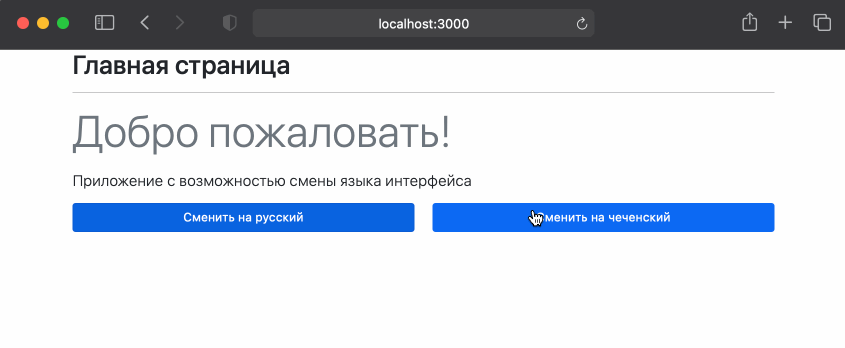

# Мультиязычное приложение на React + Context API

## Summary

Что легче – написать приложение с нуля или доработать начатое другими разработчиками? Часто на этот вопрос нет правильного ответа. Ты должен быть готов и к первому и ко второму.

Перед тобой приложение с поддержкой нескольких языков, которое кто-то начал, но не успел завершить. В нем остались две задачи: доработать кнопки переключения и добавить новый язык.

_[Материал для подготовки к работе с Context API](https://github.com/baysarov-web/context-api)_.

## Releases

### Pre-release

Сделай форк и клон данного проекта. Установи зависимости и запусти приложение на своем устройстве.

Изучи внимательно структуру файлов приложения и его код. Хорошо проанализируй Контекст, который присутствует в нем, т.к. в следующем релизе тебе предстоит работа с ним. 

### Release 0

Отправляйся сразу в компонент `Buttons`. Именно его тебе нужно доработать, чтобы приложение стало рабочим.

Подумай, какие действия внутри этого компонента заставят приложение перерисовать другие компоненты с новыми значениями контекста (с другим языком)?

Не впадай в [аналитический паралич](https://ru.wikipedia.org/wiki/%D0%90%D0%BD%D0%B0%D0%BB%D0%B8%D1%82%D0%B8%D1%87%D0%B5%D1%81%D0%BA%D0%B8%D0%B9_%D0%BF%D0%B0%D1%80%D0%B0%D0%BB%D0%B8%D1%87). Начни писать то решение, которое пришло в голову после пяти-десяти минут раздумий. Только начав писать код ты поймешь правильно было твоё решение или нет. Если даже оно окажется не правильным твоё видение проблемы станет более ясным, чтобы найти новые пути реализации задачи. 

После текущего релиза приложение должно иметь примерно такой вид:

Сейчас и в будущем старайся декомпозировать общую задачу на более маленькие части. К примеру можно сначала разобраться с тем как вывести правильные названия кнопок, а затем поработать над их функционалом.

### Release 1

Два языка хорошо, а три лучше😜. Добавь в приложение поддержку английского языка. 

Задача состоит из двух частей:

1) доработать данные контекста, чтобы там были фразы на английском;
2) добавить третью кнопку для переключения на новый язык.

Сделай новый язык также языком по умолчанию.

---

Проведи код ревью, примени Prettier, выгрузи проект и сделай pull request.

Теперь можешь немного отдохнуть, ты заслужил :)
